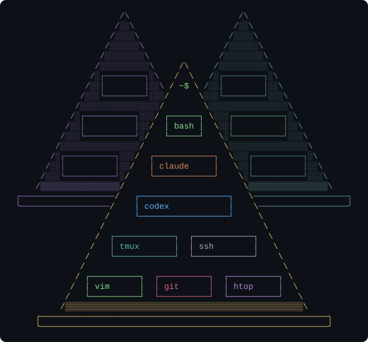
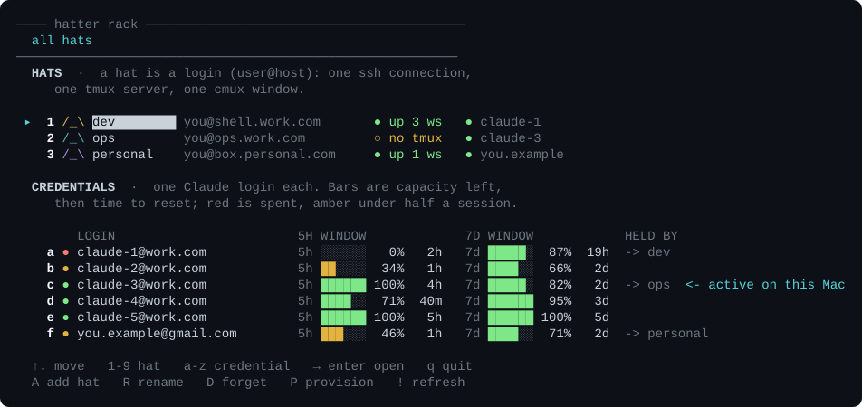

# hatter

<p align="center">
  
</p>

Which hat are you wearing right now?

`hatter` keeps a persistent, multi-machine terminal workspace that survives
losing the client, the network, or the whole laptop. Your work lives in tmux
sessions on servers you already own; the terminal on your desk is a disposable
projection of them, rebuilt from a single config file.

```
hatter
```

<p align="center">
  
</p>


## The model

Four nouns, and one of them is the idea:

| | |
|---|---|
| **hat** | a login — one `user@host`, one ssh connection, one tmux server, one terminal window. "I'm wearing my work hat." |
| **group** | a project or area inside one hat |
| **workspace** | a tmux session, named `<hat>-<subproject>` |
| **tab** | a tmux window inside that session |

The hat prefix on a session name is what selects the window and the ssh
connection, so a side project can live under your main hat as
`dev-website-parser` and still land in the right place.

**The server is the source of truth. The client is disposable.** Everything real
runs in remote tmux. `hatter sync` records the live layout into
`~/.config/hatter/config.json`; `hatter restore` rebuilds the client from it.
Reboot your laptop, reinstall the OS, switch machines — clone the config and
restore.

## What it does

- **Persistence on both ends.** tmux-resurrect and tmux-continuum are set up per
  hat, so a server reboot comes back to the same sessions. The config covers the
  client side.
- **Logging out cannot destroy a tab.** Every pane runs its login shell in a
  loop, so a stray ctrl-D hands back a fresh prompt. Two deliberate ways out:
  `bye`, or `exit 99`.
- **Credentials stay on your machine.** Claude Code logins live in your
  OS keychain and are pushed to a hat over ssh when that server needs one.
  Nothing is written to disk on either side, and no shell server is ever asked
  to log in. One login can sit on as many hats as you like — `creds push a
  --all` puts it on every one — while a hat holds exactly one at a time,
  because Claude Code reads a single credentials file. Above, `dev` and `ops`
  draw on the same pool of five work logins while `personal` keeps its own —
  the `->` column says which hats hold what right now.
- **Autosave and backup.** Rolling snapshots of the config plus one frozen
  checkpoint per 8 hours; `hatter backup` is a real git commit to a remote you
  control.
- **The hat rack.** `hatter` on its own opens an interactive walk down
  hat › group › workspace › tab, naming each level as you go, so the
  vocabulary is learned by looking around.

## Status

Working bash implementation, in daily use, macOS client. `bin/hatter` is that
tool. The plan for what comes next — a typed port, a client-adapter interface so
it is not tied to one terminal, Windows and Linux clients — is in
[EPIC.md](EPIC.md) and [issues/](issues/).

Client support today is [cmux](https://cmux.com); the
adapter interface (issue 2) is the keystone that opens it to WezTerm, wmux and a
headless mode.

## Requirements

- A client machine with `ssh`, `jq`, and a supported terminal
- One or more servers reachable over ssh, running `tmux`
- Optional: [claude-swap](https://pypi.org/project/claude-swap/) for the
  credential features

## Install

```sh
git clone https://github.com/<you>/hatter
install -m 755 hatter/bin/hatter ~/.local/bin/hatter

hatter hat add dev --ssh you@shell.work.com
hatter provision dev
hatter atlas --group "Atlas"
```

`hatter --help` explains every command; `hatter help <command>` goes deeper.

## Licence

MIT. See [LICENSE](LICENSE).
